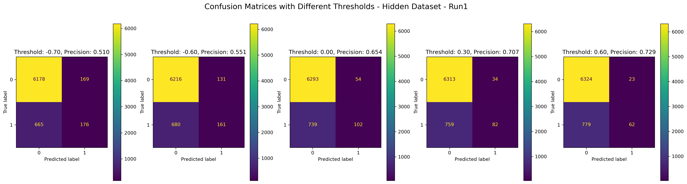
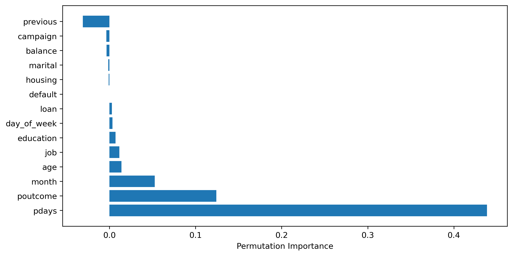
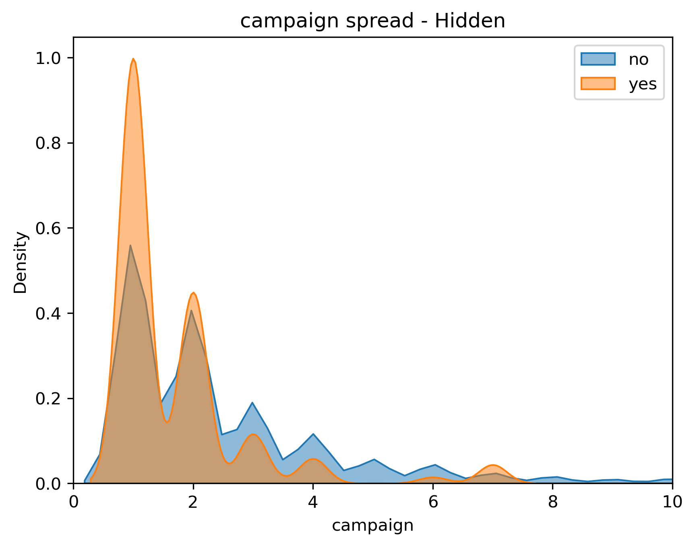

# Should we call this Customer? An Analysis
#### Jupyter Notebook with detailed analysis [here](https://github.com/nikhilmadhu/pa3_callortonotcall/blob/main/src/PracticalApplication3_BankDeposit.ipynb)

## Business Goal
'Bank' is releasing a new term deposit product and has limited amount of resources to market it to customers. This analysis aims to create a model that is able to identify customers who have a high likelyhood of signing on so the marketing resources could be deployed most effectively.

## Actionable Insights from the Analysis
1. Plan to conduct the campaign during March, October and September
2. Focus on existing customers
3. Focus on customers who have not been contacted in the last 3 or 6 months

## Data
This Bank marketing data is provided courstey of [UCI Machine learning repositoy](https://archive.ics.uci.edu/dataset/222/bank+marketing) and has data from a portugese bank.
- 16 features across 45K observations are available in this dataset
- The target variable is a boolean that indicates 'yes' or 'no'
- It is higly imbalanced dataset as 88% of data has "No"
- There is no specific collinearity seen between features
- No direct reationship is clearly visible between the various features and the target variable (except for duration = 0 cases)
- Relationships between cateories
   
- Relationship between categories and target variable
   
- Relationship between numerical features and target variable
   

### Data manipulation / clean up
- drop 'duration' and 'contact' as they are deemed irrelevant for this analysis
- 'job' and 'education' have a small amount of 'NaN's.
  - 'job' > drop all records with 'NaN'
  - 'education' > 'NaN' can be rolled into the mode of the features without loosing relevant information
- 'poutcome' > When previous = 0, fill as 'not contacted', otherwise, mark as 'other'

- The final Final dataset (44923 rows with 14 features and 1 Target variable)
  
  

## Modeling
Various classification modeling techniques were used to predict if a customer would sign on for the new deposit product. KNearestneighbor, Suppot Vector Machines, Decision Tree and Logistic Regression models were compared and contrasted to identify the best model. As the dataset is imbalaced, SMOTENC was used to syntetically balance the dataset. 

Precision was used as the metric to optimze for as false positives would result in wasted resources.

As smote was used, a portion of dataset was kept hidden from the training and testing datasets to validate efficacy of final model

Results (scores and performance) from multiple modeling runs are tabulated as follows:

Results from evaluation of various decision thresholds

### Best Model
  - Type: Suport Vector Machine
  - Params:
      - {'classifer__C': 1, 'classifer__gamma': 'auto', 'classifer__kernel': 'rbf'}
      - Threshold for classification : 0.3
      - Test dataset Precision score : 0.71
      - Hidden dataset Precision score : 0.77
  - Reasoning: The precision score improved to 0.77 when decision thresholds were increased to 0.3, and at this point, still generates enough number of leads to go after
    
    
    

## Inference
- Using Permutation importance, the impact of features on the model was identified as follows - 
  
- Relationship of each feature with the predicted outcome is as follows
  
- By further digging into the 'pdays' feature indicate that 'pdays' of ~180 and ~100 have good conversion ratios

- Another interesting observation is that as the customers start getting targeted for more 'campaign's, the conversion rations decrease

   
## Deployment
- The model can be extracted for deployment using the joblib libraries and converted to an API using FastAPI (details provides in the workbook)

## Next steps
- Continue to fine tune the models and separate out models where duration information is availble and where it is not. I believe considering the 'duration' feature for customers who have been contacted at least once would help improve the precision of those models.
